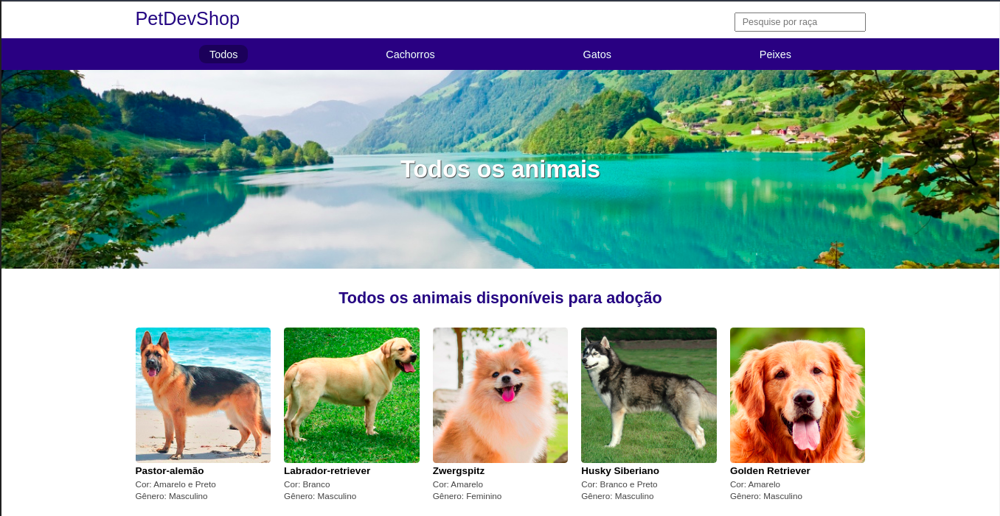

# PetDevShop

  

  <b>Página de listagem de animais.</b>

 

    

## Conteúdo

- [Sobre](#sobre)
- [Tecnologias](#tecnologias)
- [Pré-requisitos](#pre-requisitos)
- [Como usar](#como-usar)
- [Como contibuir](#como-contribuir)

## :bookmark: Sobre

Projeto feito para treinar NodeJs e Typpescript em que foi realizado um sistema para listagem de animais, junto com filtros de pesquisa. Esse projeto foi realizado em um módulo de NodeJs da B7Web ministrada por Bonieky Lacerda.

## :rocket: Tecnologias Utilizadas

O projeto foi desenvolvido utilizando as seguintes tecnologias

- [JavaScript](https://javascript.com/)
- [NodeJS](https://nodejs.org/)
- [Typescript](http://typescriptlang.org/)

## :fire: **Pré-requisitos**

- [Node.js](https://nodejs.org/en/)
- [NPM](https://www.npmjs.com/) ou [Yarn](https://yarnpkg.com/)

## :zap: Como usar

- Faça um clone desse repositório: `git clone https://github.com/Oliveiiraa/PetDevShop.git`

- Entre na pasta: `cd PetDevShop`

- Instale as dependências: `yarn install` ou `npm install`

- Rode o comando de inicialização: `yarn start` ou `npm start`

## :recycle: Como contribuir

- Faça um Fork desse repositório,
- Crie uma branch com a sua feature: `git checkout -b my-feature`
- Commit suas mudanças: `git commit -m 'feat: My new feature'`
- Push a sua branch: `git push origin my-feature`

---

<h4 align=center>Made with 💙 by <a href="https://www.linkedin.com/in/gabriel-h-oliveira/">Gabriel Oliveira</a></h4>